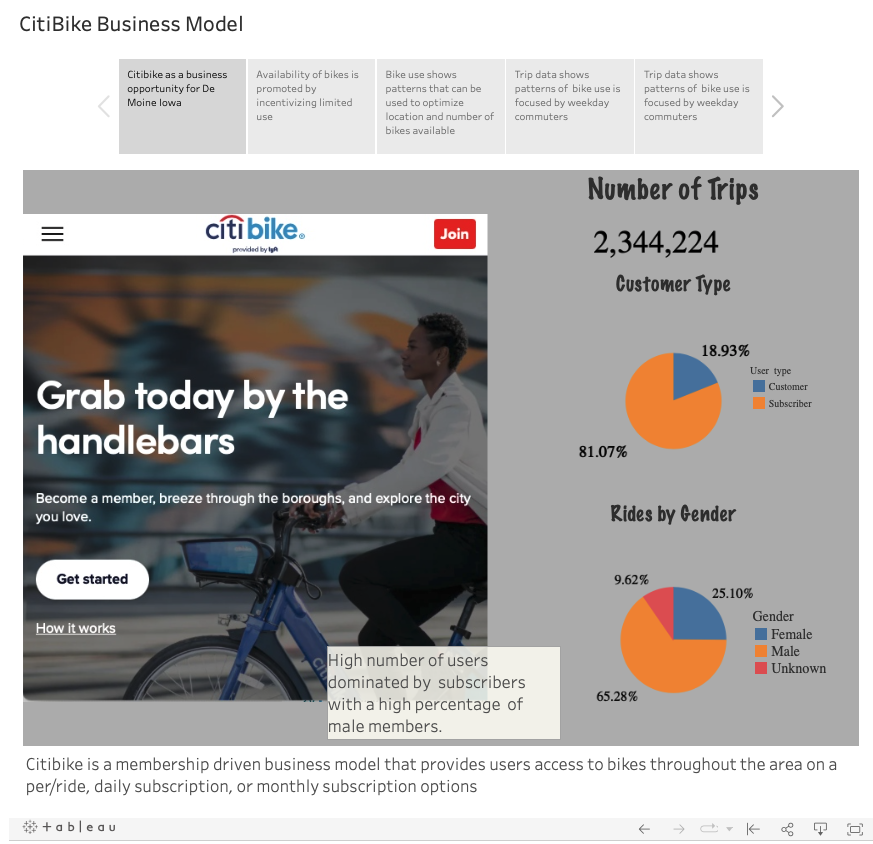
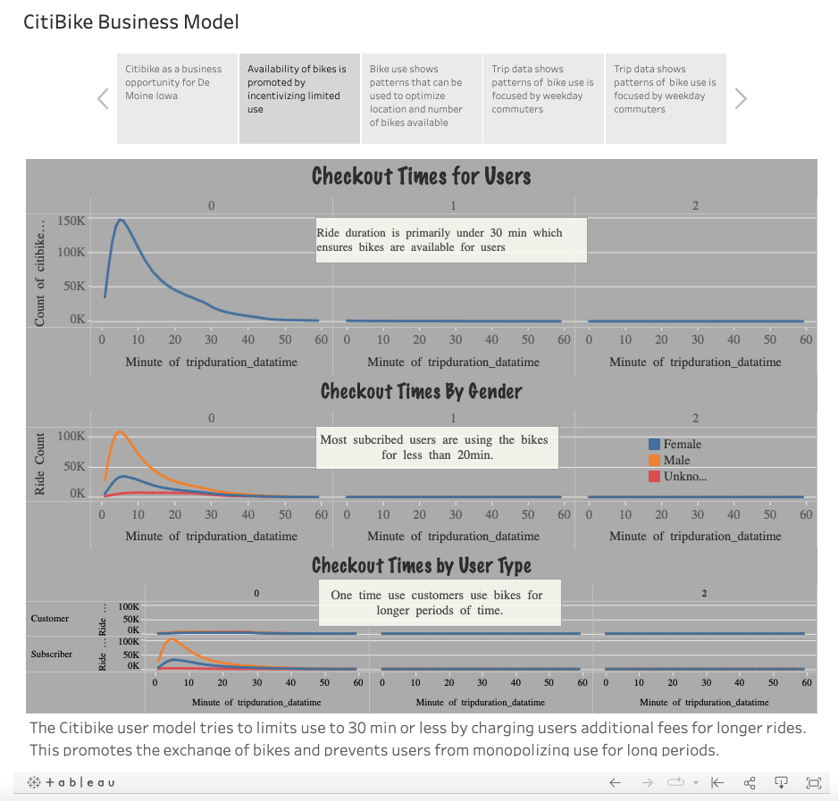
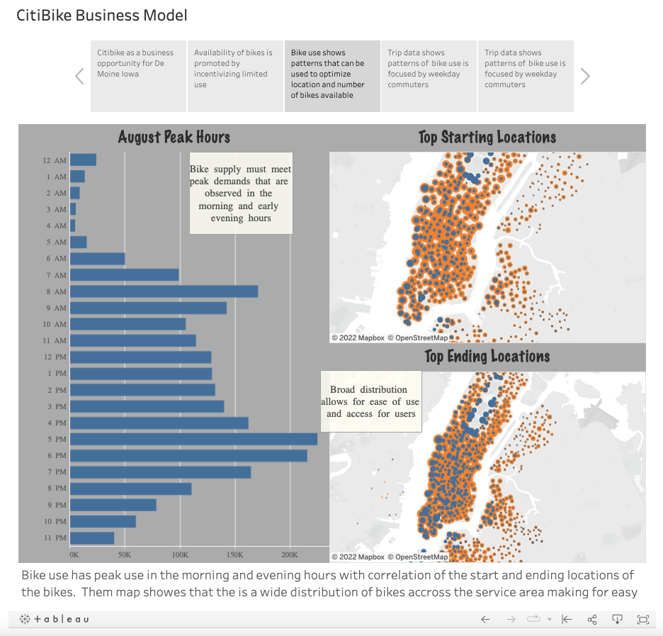
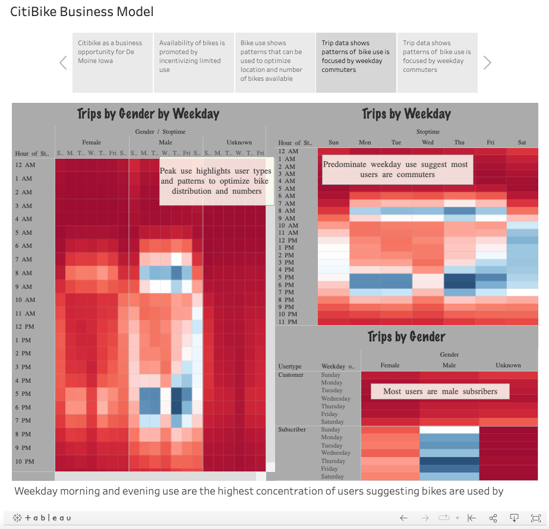
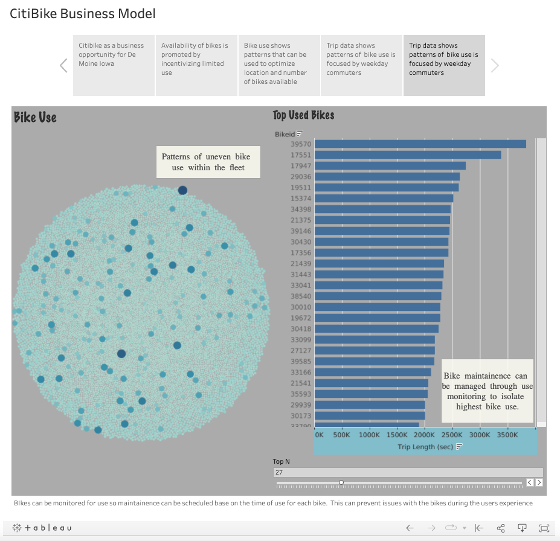

# Citibike Business Analysis for Des Moines

## Overview

This is an analysis of the viability of the New York City bike sharing business [Citibike](https://citibikenyc.com/homepage) being introduced into Des Moines, Iowa as a potential business opportunity.  The Citibike model is a ride-share program for bikes that allows users to have access to bikes throughout the city on a pay/ride, daily subscription or monthly subscription pay model.  Users of the service can pickup and drop off bikes at any location and make use of the bikes for limited periods.  The success of the program in NYC indicates that there is potential for this model to be released in other city markets.  To analyze this, data available on the [Citibike webpage](https://ride.citibikenyc.com/system-data) was used to evaluate rides over a one-month period of August 2019 to see the ride use history and identify any patterns that can give insight on how best to launch this program on other markets.  To present the analysis, visuals create on Tableau highlight the finding and illustrate the conclusions obtained from the dataset studied.

---

## Results

The analysis of the data collected by Citibike on the use of the bicycles in New York City was classified into 5 categories to share the patterns observed to provide insight into the use over the one-month period.  The first part was to look at overall use and demographics of the users to show how the program is used and the overall volume of rides observed.  Second, is to look how the bike use model of limiting rides to 30 minutes to prevent extra fees limits long bike uses and monopolization of bikes by users to ensure that bike are available for exchange.  The next area of analysis was to determine patterns of use do determine peak demands and distribution as seen in the New York market.  This is followed by an analysis of weekly use to show see how rider use changes over the week to share how users are using the service.  Finally, is an overview of the ride use for each bike to determine how bike use is distributed and how maintenance of the bicycles should be managed and executed.  The finding of this analysis are presented in this [link to Tableau story data sheet](https://public.tableau.com/views/CitiBikeChallenge_16427113061650/CitiBikeBusinessModel?:language=en-US&:display_count=n&:origin=viz_share_link).  The data visualizations show the key findings and can act as a template for the development of a business case for introduction of the program in other city markets.

Demographic of Citibike users in New York City (Aug 2019)

Length of bike use by users across gender and usertype.

Ride patterns by location and time in New York City (Aug 2019).

Weekly ride use patterns observed in NYC (Aug 2019).

Time of use of each bike in the NYC fleet (Aug 2019)

---

## Summary

The analysis of the data collected by Citibike presents some insight on the use and patterns for the program across the market.  From the data it is evident the majority of users are subscribers and based on the use patterns, use the bicycles for commuting within the city.  Peak use hours are in the morning and late afternoon with most of the rides occurring between Monday and Friday during the week.  This suggests that cities looking at this model should have an active centralized downtown with commuter distance within a roughly 30-min ride by bicycle.  The use of the bike does not appear distributed with a few bikes being used more than others requiring monitoring to ensure that bikes are maintained to ensure the user gets the best possible experience on the bike they use. Dependability of the bicycles is paramount to the success of the program.  Additionally, as NYC has numerous tourist that visit the city and the Citibike program does offer users single day unlimited use passes, it can be assumed that a number of the rides were done by visitors to the city.  This can be a benefit for other markets that have a large tourism industry as an option for users to move from location to location.  

The analysis of the data allowed some insight on the success of the Citibike program and how the rollout of this program in other markets can be delivered to optimize success.  The data collect was extensive however missing in the data were some key elements.

1. Cost per ride to determine the economics of the bicycle ride-share model
2. Differentiation between daily use subscribers and monthly subscribers to give insight into the number of uses by tourists in NYC.

---

